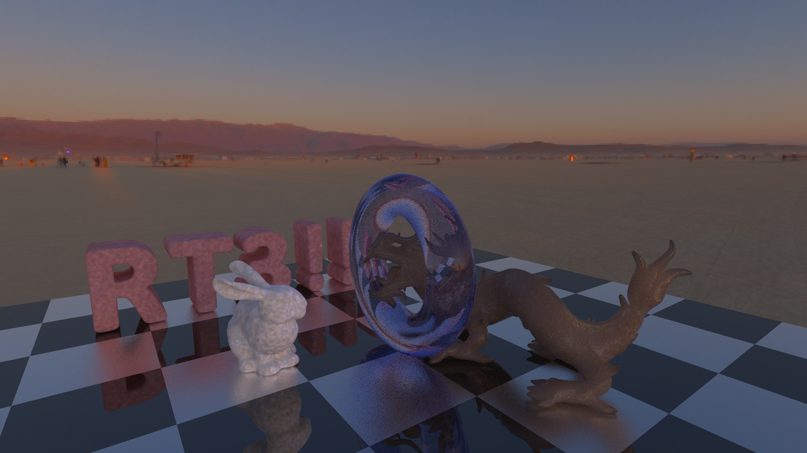

tatsy-pppm
===

> Phisically-based path tracer for [Ray tracing camp 3!!!](https://sites.google.com/site/raytracingcamp3/)

## Installation

```shell
$ git clone https://github.com/tatsy/photon-diffusion.git
$ cmake -DENABLE_AVX=OFF .
$ cmake --build .
```

## Overview

* **Integrator:** Progressive Photon Mapping: A Probabilistic Approach [Knaus and Zwicker 2011]
* **BSSRDF:** Dipole diffusion model [Jensen et al. 2001]

## Result



## Acknowledgment

The author sincerely appreciates the following websites for asset data.

**Asian dragon (PLY mesh model)**
* The Stanford 3D Scanning Repository: http://graphics.stanford.edu/data/3Dscanrep/

**Suway station (HDR image for IBL)**
* sIBL Archive: http://www.hdrlabs.com/sibl/archive.html

## License

MIT License 2015 (c) tatsy, Tatsuya Yatagawa
